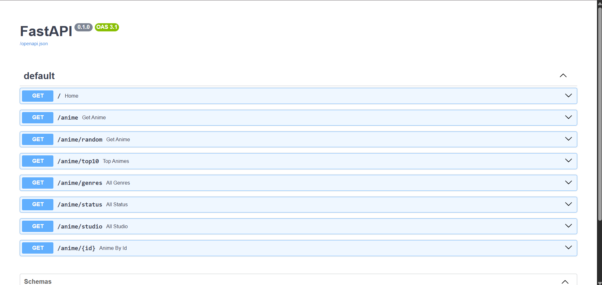

# 🎌 AnimeDex API

A beginner-friendly **REST API** built with **FastAPI** to explore and manage anime data.

AnimeDex API demonstrates RESTful API development using FastAPI, including CRUD operations, request validation with Pydantic, filtering, sorting, proper HTTP status codes, and exception handling.

---

## 🚀 Features

### 📖 Read Operations
- 📚 Get all anime
- 🔍 Get anime by ID
- 🎲 Get a random anime
- ⭐ Get Top 10 highest-rated anime
- 🎭 Filter anime by genre
- 📺 Filter anime by status
- 🏢 Filter anime by studio
- 📂 List all available genres
- 📋 List all available statuses
- 🎬 List all available studios

### ✏️ Write Operations
- ➕ Create a new anime
- ♻️ Update an existing anime
- 🗑️ Delete an anime

### ✅ Validation & Error Handling
- Request validation using **Pydantic**
- Enum validation for anime status
- Automatic response validation
- Proper HTTP status codes
- 404 error handling using `HTTPException`

---

## 🛠️ Tech Stack

- Python 3
- FastAPI
- Pydantic
- Uvicorn

---

## 📁 Project Structure

```
AnimeDex-API/
│
├── main.py              # FastAPI application
├── data.py              # In-memory anime dataset
├── models.py            # Pydantic models
├── requirements.txt
├── README.md
└── .gitignore
```

---

## 📡 API Endpoints

| Method | Endpoint | Description |
|---------|----------|-------------|
| GET | `/` | Welcome message |
| GET | `/anime` | Get all anime or filter anime |
| GET | `/anime/{id}` | Get anime by ID |
| GET | `/anime/random` | Get a random anime |
| GET | `/anime/top10` | Get Top 10 anime |
| GET | `/anime/genres` | List all genres |
| GET | `/anime/status` | List all statuses |
| GET | `/anime/studio` | List all studios |
| POST | `/anime` | Create a new anime |
| PUT | `/anime/{id}` | Update an existing anime |
| DELETE | `/anime/{id}` | Delete an anime |

---

## 🔎 Query Parameters

The `/anime` endpoint supports filtering.

### Filter by Genre

```
GET /anime?genre=Action
```

### Filter by Status

```
GET /anime?anime_status=Completed
```

### Filter by Studio

```
GET /anime?studio=MAPPA
```

### Combine Multiple Filters

```
GET /anime?genre=Action&anime_status=Completed&studio=Pierrot
```

---

## 📝 Request Body

### Create Anime

```json
{
  "title": "Monster",
  "genre": "Thriller",
  "episodes": 74,
  "rating": 9.2,
  "studio": "Madhouse",
  "release_year": 2004,
  "status": "Completed"
}
```

The same request body is used for updating an anime.

---

## ⚙️ Installation

### Clone the repository

```bash
git clone https://github.com/Pranavkr323/Anime-Dex.git
```

### Navigate to the project

```bash
cd Anime-Dex
```

### Create a virtual environment

```bash
python -m venv venv
```

### Activate the virtual environment

**Windows**

```bash
venv\Scripts\activate
```

**macOS / Linux**

```bash
source venv/bin/activate
```

### Install dependencies

```bash
pip install -r requirements.txt
```

### Run the development server

```bash
uvicorn main:app --reload
```

---

## 📖 Interactive API Documentation

Once the server is running:

### Swagger UI

```
http://127.0.0.1:8000/docs
```

### ReDoc

```
http://127.0.0.1:8000/redoc
```

---

## 📸 Preview

FastAPI automatically generates interactive API documentation.



---

## 🎯 Learning Outcomes

Through this project, I learned:

- FastAPI fundamentals
- REST API design
- CRUD operations
- Path parameters
- Query parameters
- Request validation with Pydantic
- Response models
- Enum validation
- HTTP status codes
- Exception handling
- JSON serialization
- API documentation with Swagger UI

---

## 🚧 Future Improvements

- [ ] Replace in-memory storage with SQLite
- [ ] Integrate SQLAlchemy ORM
- [ ] Async database operations
- [ ] API Routers
- [ ] JWT Authentication
- [ ] Pagination
- [ ] Unit testing with Pytest
- [ ] Docker support
- [ ] Deploy to Render or Railway

---

## 📄 License

This project is licensed under the MIT License.

---

## 👨‍💻 Author

**Pranav Kumar**

Backend Developer • Python Enthusiast • FastAPI Learner

GitHub: https://github.com/Pranavkr323