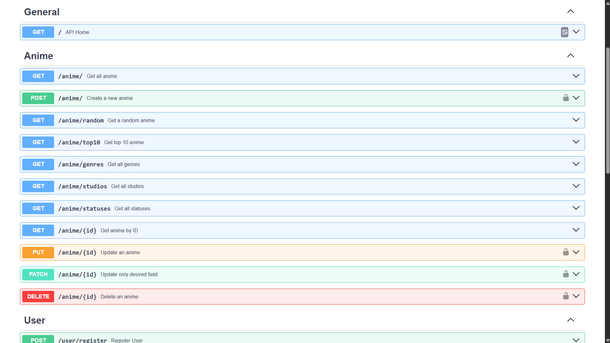
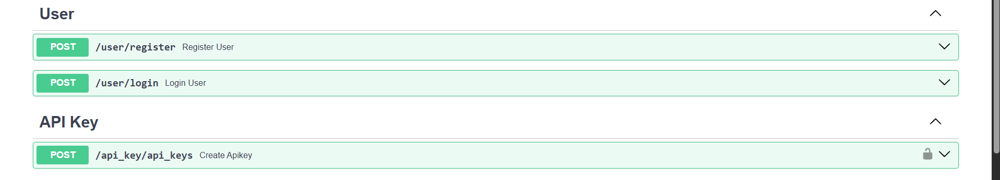
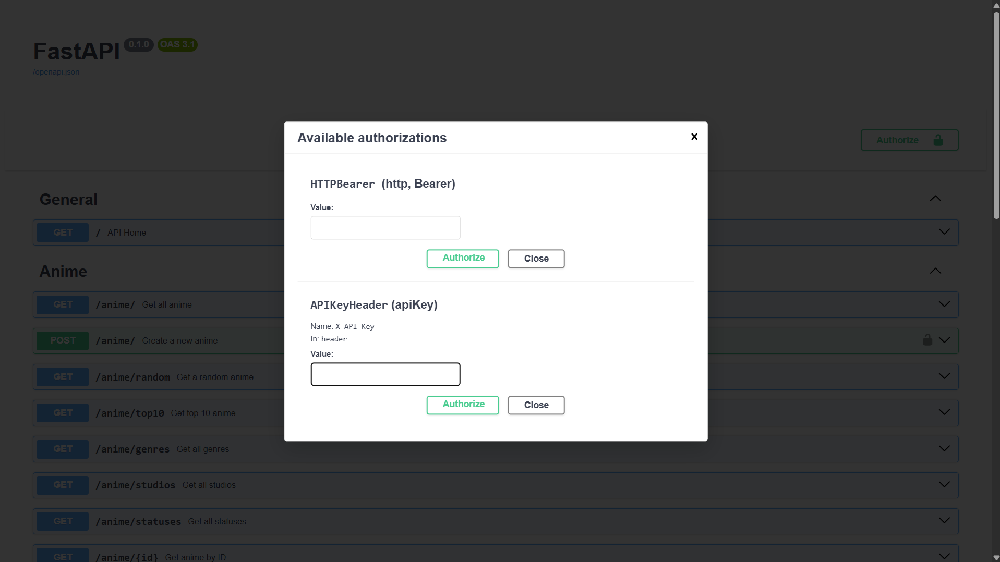

# 🎌 AnimeDex API

A **FastAPI-based REST API for managing anime data**, evolved from a simple CRUD application into a structured backend with **SQLAlchemy, JWT authentication, API-key authorization, middleware, modular routing, and environment-based configuration**.

AnimeDex V4 focuses on practical backend engineering concepts such as REST API design, database management, authentication, authorization, validation, dependency injection, and separation of concerns.

---

## 🚀 V4 Highlights

AnimeDex V4 introduces a major backend upgrade over V3:

* 🔐 JWT-based user authentication
* 🔑 API-key based authorization
* 🔒 Secure password hashing with `pwdlib`
* 🛡️ JWT + API-key ownership verification for sensitive operations
* 🧩 Modular routing with FastAPI `APIRouter`
* ⚡ Custom request-timing middleware
* 🗄️ SQLAlchemy 2.0 ORM with SQLite
* ✏️ Full and partial anime updates using `PUT` and `PATCH`
* ⚙️ Environment-based configuration with Pydantic Settings
* ✅ Structured validation and error handling

---

## ✨ Features

### 📚 Anime API

* Get all anime
* Get anime by ID
* Get a random anime
* Get top 10 highest-rated anime
* Retrieve unique genres
* Retrieve unique studios
* Retrieve unique statuses
* Filter anime by genre, studio, and status
* Create anime
* Fully update anime
* Partially update anime
* Delete anime

### 🔐 Authentication

* User registration
* Secure password hashing
* User login
* JWT access-token generation
* JWT validation
* Bearer authentication
* Protected endpoints

### 🔑 API Keys

* Generate API keys for authenticated users
* Cryptographically secure key generation
* Store API-key secrets as hashes
* Validate API keys
* Check API-key status
* Verify API-key ownership

### ⚡ Middleware

Custom `TimerMiddleware` measures request processing time and adds the result to the response:

```http
X-Process-Time: 0.00421
```

---

## 🛡️ Authentication & Authorization

AnimeDex V4 uses two layers of security for sensitive operations.

### JWT Authentication

After registering and logging in, the client receives a JWT access token.

```http
Authorization: Bearer <access_token>
```

The JWT identifies the authenticated user.

### API-Key Authorization

Authenticated users can generate an API key:

```http
POST /api_key/api_keys
```

The API key is supplied using:

```http
X-API-Key: <api_key>
```

The server validates the key, checks its status, and verifies that it belongs to the authenticated user.

### Protected Request Flow

```text
Client Request
      │
      ▼
JWT Authentication
      │
      ▼
Identify User
      │
      ▼
API Key Validation
      │
      ▼
Verify Key Ownership
      │
      ▼
Perform Operation
```

This demonstrates the distinction between:

* **Authentication** — Who are you?
* **Authorization** — Are you allowed to perform this operation?

---

## ✏️ PUT vs PATCH

AnimeDex V4 supports both full and partial updates.

### PUT

Used for a full update of an anime resource.

```http
PUT /anime/{id}
```

### PATCH

Used when only specific fields need to be changed.

```http
PATCH /anime/{id}
```

For example:

```json
{
  "rating": 9.3,
  "status": "Completed"
}
```

This allows partial resource modification without resending the entire anime object.

---

## 🗄️ Database

AnimeDex uses **SQLite** for persistent storage and **SQLAlchemy 2.0** as the ORM.

Key database concepts used:

* SQLAlchemy ORM
* `Mapped` and `mapped_column`
* Database sessions
* Dependency-injected sessions
* CRUD abstraction
* Model relationships
* Enum-based fields
* Persistent SQLite storage

---

## 🛠️ Tech Stack

| Technology        | Purpose              |
| ----------------- | -------------------- |
| Python            | Programming language |
| FastAPI           | REST API framework   |
| SQLAlchemy 2.0    | ORM                  |
| SQLite            | Database             |
| Pydantic          | Validation & schemas |
| Pydantic Settings | Configuration        |
| pwdlib            | Password hashing     |
| joserfc           | JWT handling         |
| Starlette         | Middleware           |
| Uvicorn           | ASGI server          |

---

## 📁 Project Structure

```text
Anime-Dex/
│
├── app/
│   ├── routers/
│   │   ├── anime.py          # Anime routes
│   │   ├── user.py           # Authentication routes
│   │   └── apikey_route.py   # API-key routes
│   │
│   ├── crud.py               # Database operations
│   ├── database.py           # Database configuration
│   ├── dependencies.py       # Shared dependencies & authentication
│   ├── enums.py              # Enum definitions
│   ├── main.py               # FastAPI application
│   ├── middleware.py         # Request timing middleware
│   ├── models.py             # SQLAlchemy models
│   ├── schemas.py            # Pydantic schemas
│   ├── config.py              # Application configuration
│   └── utils.py               # Authentication utilities
│
├── seed.py
├── requirements.txt
├── README.md
├── .gitignore
└── LICENSE
```

---

## 📡 API Endpoints

### General

| Method | Endpoint | Description |
| ------ | -------- | ----------- |
| GET    | `/`      | API home    |

### Anime

| Method | Endpoint          | Auth          |
| ------ | ----------------- | ------------- |
| GET    | `/anime/`         | —             |
| GET    | `/anime/{id}`     | —             |
| GET    | `/anime/random`   | —             |
| GET    | `/anime/top10`    | —             |
| GET    | `/anime/genres`   | —             |
| GET    | `/anime/studios`  | —             |
| GET    | `/anime/statuses` | —             |
| POST   | `/anime/`         | JWT           |
| PUT    | `/anime/{id}`     | JWT           |
| PATCH  | `/anime/{id}`     | JWT + API Key |
| DELETE | `/anime/{id}`     | JWT + API Key |

### Users

| Method | Endpoint         | Description           |
| ------ | ---------------- | --------------------- |
| POST   | `/user/register` | Register a user       |
| POST   | `/user/login`    | Login and receive JWT |

### API Keys

| Method | Endpoint            | Auth |
| ------ | ------------------- | ---- |
| POST   | `/api_key/api_keys` | JWT  |

---

## 🔎 Filtering

Anime can be filtered using query parameters:

```http
GET /anime/?genre=Action
```

```http
GET /anime/?studio=Madhouse
```

```http
GET /anime/?status=Completed
```

Multiple filters can be combined:

```http
GET /anime/?genre=Action&studio=MAPPA&status=Completed
```

---

## 📝 Example Anime Object

```json
{
  "title": "Monster",
  "genre": "Thriller",
  "episodes": 74,
  "rating": 9.2,
  "studio": "Madhouse",
  "release_year": 2004,
  "status": "Completed"
}
```

---

## ⚙️ Installation

### 1. Clone the repository

```bash
git clone https://github.com/Pranavkr323/Anime-Dex.git
cd Anime-Dex
```

### 2. Create a virtual environment

```bash
python -m venv venv
```

### 3. Activate the environment

**Windows**

```bash
venv\Scripts\activate
```

**macOS / Linux**

```bash
source venv/bin/activate
```

### 4. Install dependencies

```bash
pip install -r requirements.txt
```

### 5. Configure environment variables

Create a `.env` file with the required application configuration.

Do not commit secrets such as JWT signing keys to the repository.

### 6. Run the server

```bash
uvicorn app.main:app --reload
```

The API will be available at:

```text
http://127.0.0.1:8000
```

---

## 📖 API Documentation

FastAPI automatically provides interactive documentation.

---

## 📸 API Preview

### Swagger UI

Interactive API documentation generated automatically by FastAPI.




### JWT + API Key Authorization

Protected endpoints require JWT authentication along with a valid API key where applicable.



---

### Swagger UI

```text
http://127.0.0.1:8000/docs
```

### ReDoc

```text
http://127.0.0.1:8000/redoc
```

Swagger UI can be used to explore endpoints, inspect schemas, authenticate with JWT, provide API keys, and test protected operations.

---

## 🎯 What I Learned

### Backend Development

* REST API design
* FastAPI application structure
* APIRouter
* Dependency injection
* Middleware
* Request/response handling
* HTTP status codes
* Exception handling

### Database

* SQLAlchemy 2.0
* ORM-based database operations
* SQLite
* Database sessions
* CRUD abstraction
* Model relationships

### Authentication & Security

* Password hashing
* JWT authentication
* Bearer authentication
* Token validation
* API-key generation
* API-key hashing
* API-key verification
* Ownership-based authorization
* Authentication vs authorization

### API Design

* Query parameter filtering
* PUT vs PATCH
* Pydantic schemas
* Validation
* Separation of concerns
* Modular backend architecture

---

## 🚧 Future Improvements — V5

Potential areas for the next version:

* [ ] Automated testing with Pytest
* [ ] Database migrations with Alembic
* [ ] PostgreSQL support
* [ ] Pagination
* [ ] Async SQLAlchemy
* [ ] Dockerization
* [ ] CI/CD
* [ ] API rate limiting
* [ ] Logging & monitoring
* [ ] Production deployment
* [ ] Anime watchlists & favorites

---

## 📄 License

This project is licensed under the MIT License.

---

## 👨‍💻 Author

**Pranav Kumar**

Backend Developer • Python • FastAPI • SQLAlchemy

* GitHub: https://github.com/Pranavkr323
* LinkedIn: https://www.linkedin.com/in/pranavkr323/

If you found AnimeDex useful or interesting, consider giving the repository a ⭐.
